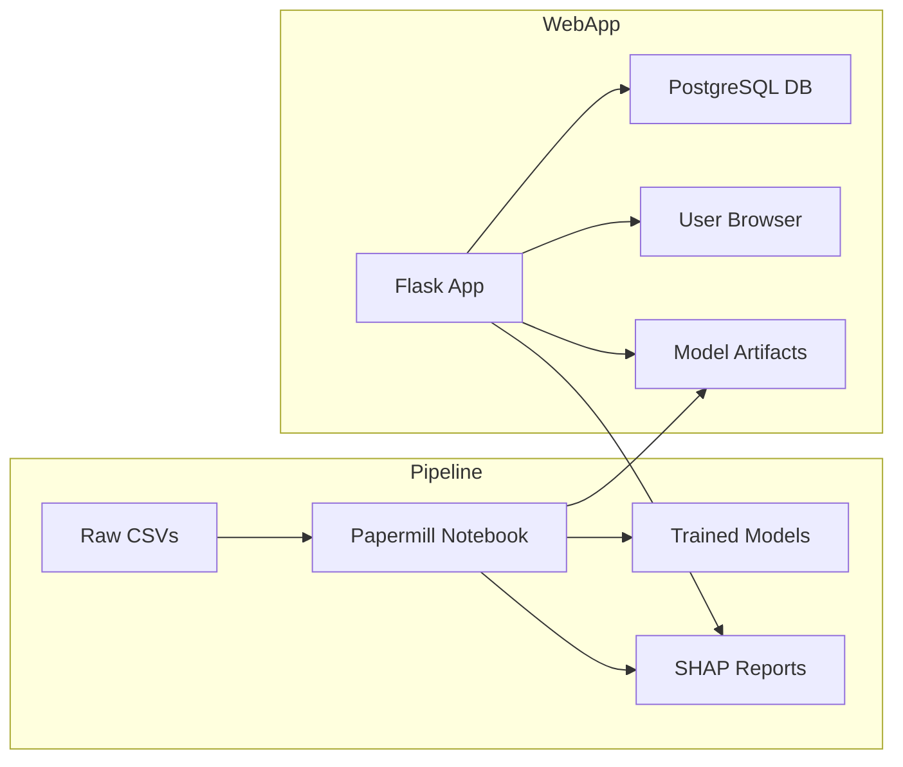

# PulmoGuard AI

A comprehensive Flask-based web application for lung cancer risk prediction and analysis, featuring automated model training, explainability, secure user management, and containerized deployment.

---

## Table of Contents

1. [Description](#description)
2. [Features](#features)
3. [Architecture Overview](#architecture-overview)
4. [Prerequisites](#prerequisites)
5. [Installation & Setup](#installation--setup)

   * [Clone & Environment](#clone--environment)
   * [Install Dependencies](#install-dependencies)
   * [Configure Environment Variables](#configure-environment-variables)
6. [Database Initialization](#database-initialization)
7. [Automated Training Pipeline](#automated-training-pipeline)
8. [Model Explainability Reports](#model-explainability-reports)
9. [Running the Web Application](#running-the-web-application)
10. [Dockerized Deployment](#dockerized-deployment)
11. [Project Structure](#project-structure)
12. [Contributing](#contributing)
13. [License](#license)

---

## Description

PulmoGuard AI is designed to streamline the end-to-end workflow of lung cancer risk prediction. It integrates:

* **Data ingestion & preprocessing** via automated Jupyter notebooks (Papermill)
* **Model training & versioning** (Random Forest, SVM, XGBoost, MLP, etc.)
* **Explainability** with SHAP to interpret model output
* **Web interface** for user registration, login, prediction input, and result visualization
* **Secure authentication** using Flask-Login and PostgreSQL
* **Containerization** with Docker Compose for one‑command deployment

---

## Features

* **Automated Pipelines**: Headless execution of training notebooks capturing metrics and HTML reports.
* **Model Explainability**: SHAP-based feature impact plots embedded in user results.
* **Secure User Management**: Registration, login, password hashing, and session control.
* **RESTful Endpoints**: `/predict`, `/train`, and `/reports` for programmatic access.
* **Environment Config**: `.env` driven settings for secrets, DB credentials, and hyperparameters.
* **Containerized Architecture**: Flask app, Postgres database, and pipeline scripts orchestrated via Docker Compose.

---

## Architecture Overview



---

## Prerequisites

* **Ubuntu 20.04+** (or any Linux/macOS/WSL)
* **Python 3.8+**
* **Docker & Docker Compose** (for containerized deployment)
* **pip** (Python package manager)

---

## Installation & Setup

### Clone & Environment

```bash
git clone https://github.com/Dani-Nade/PulmoGuard-AI.git
cd PulmoGuard-AI
python3 -m venv venv
source venv/bin/activate
```

### Install Dependencies

```bash
pip install --upgrade pip
pip install -r requirements.txt
```

### Configure Environment Variables

Copy `.env.example` to `.env` and fill in your values:

```ini
FLASK_APP=app.py
FLASK_ENV=development
DATABASE_URL=postgresql://user:password@db:5432/pulmoguard
SECRET_KEY=your-secret-key
```

---

## Database Initialization

Start Postgres locally (or via Docker) and create the DB:

```bash
# If using local Postgres
psql -U postgres -c "CREATE DATABASE pulmoguard;"

# If using Docker Compose later, Compose will auto-create via SQLAlchemy
```

Run any migrations (if applicable) or let the app auto-create tables on first login.

---

## Automated Training Pipeline

Headless execution of your Jupyter notebooks is managed by Papermill:

```bash
# Run full pipeline
papermill notebooks/train_pipeline.ipynb output/reports/train_output.ipynb
```

This generates:

* `models/` folder with timestamped model files
* `reports/` folder with HTML metrics and logs

You can schedule this via cron or CI/CD for daily retraining.

---

## Model Explainability Reports

SHAP-based analysis is embedded in the pipeline notebook:

```bash
papermill notebooks/explainability.ipynb output/reports/explain_output.ipynb
```

View the generated HTML to see:

* Global feature importance
* Local explanations per patient prediction

---

## Running the Web Application

```bash
# Activate virtualenv
source venv/bin/activate
# Start Flask
flask run --host=0.0.0.0 --port=5000
```

Open your browser at `http://localhost:5000`:

1. **Register** a new user.
2. **Login** to access the prediction form.
3. **Submit** clinical inputs and view risk score with SHAP plot.

---

## Dockerized Deployment

Spin up the entire stack with Docker Compose:

```bash
docker-compose up -d --build
```

Services:

* **web**: Flask app on port 5000
* **db**: PostgreSQL 13
* **pipeline** (optional): runs training and reports

Teardown:

```bash
docker-compose down
```

---

## Project Structure

```
PulmoGuard-AI/
├── app.py                    # Flask application entry point
├── requirements.txt          # Python dependencies
├── Dockerfile                # Build instructions for web service
├── docker-compose.yaml       # Multi-service orchestration
├── notebooks/                # Jupyter notebooks for training & explainability
│   ├── train_pipeline.ipynb
│   └── explainability.ipynb
├── papermill_pipeline/       # Python scripts for headless notebook execution
├── models/                   # Trained model artifacts
├── reports/                  # Generated HTML reports
├── templates/                # Jinja2 HTML templates
├── static/                   # CSS & JS assets
└── README.md
```

---

## Contributing

Contributions are welcome! Please:

1. Fork the repo
2. Create a feature branch (`git checkout -b feature/XYZ`)
3. Commit your changes (`git commit -m 'Add feature XYZ'`)
4. Push to your branch (`git push origin feature/XYZ`)
5. Open a Pull Request

---

## License

MIT © 2025 | Dani-Nade
